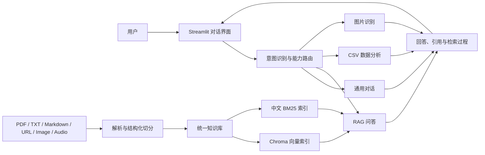

<h1 align="center">Enterprise AI Copilot</h1>

<p align="center">
  基于 Streamlit、LangChain 与通义千问构建的多能力企业智能助手。<br>
  通过统一对话入口，自动路由知识库问答、CSV 数据分析、图片识别和通用对话任务。
</p>

<p align="center">
  <a href="https://www.python.org/"></a>
  <a href="https://streamlit.io/"></a>
  <a href="https://www.langchain.com/"></a>
  <a href="#测试"></a>
</p>

<p align="center">
  <a href="#核心能力">核心能力</a> ·
  <a href="#系统架构">系统架构</a> ·
  <a href="#快速开始">快速开始</a> ·
  <a href="#rag-检索链路">RAG 检索链路</a> ·
  <a href="#量化评测">量化评测</a> ·
  <a href="#项目结构">项目结构</a>
</p>

## 项目简介

Enterprise AI Copilot 是一个面向企业知识检索与日常办公场景的 AI 助手示例。用户可以将 PDF、文本、网页、图片和音频加入同一个知识库，再直接使用自然语言提问；系统也支持上传 CSV 进行统计分析、生成图表，或对单张图片进行内容识别。

项目重点不只是完成一次“向量检索 + LLM”的调用，而是实现了一条可观察、可降级的 RAG 链路：结合对话历史改写问题，通过向量检索与中文 BM25 多路召回，使用 RRF 融合结果，再由 LLM 进行相关性精排和阈值过滤，最终生成带来源定位的回答。

> 当前项目定位为学习与本地演示项目，不应直接作为生产系统部署。

## 核心能力

| 能力 | 实现说明 |
| --- | --- |
| 智能意图路由 | 使用 Qwen Turbo 识别一个或多个任务，按置信度路由至 RAG、数据分析、图片识别或通用对话 |
| 自适应 RAG | 知识库非空时，普通问题会先进行相关性预检；命中资料后自动切换至 RAG，未命中则继续普通问答 |
| 多来源知识库 | 统一管理 PDF、TXT/Markdown、网页、图片和音频，可跨来源检索、按来源删除并展示引用位置 |
| 混合检索 | 对原问题和改写问题分别执行向量检索与中文 BM25 召回，并通过 RRF 完成去重和排序融合 |
| LLM 精排 | 使用 Listwise 方式为候选 Chunk 评分，通过相关性阈值过滤主题相似但无法提供直接证据的内容 |
| 结构化切分 | 优先识别 Markdown 标题、章节、条款和编号结构，再在结构段内部按长度切分并保留元数据 |
| CSV 数据分析 | 根据自然语言生成 Pandas/Matplotlib 代码，在受限子进程中执行并返回统计结果或图表 |
| 多模态理解 | 使用视觉模型提取图片中的 OCR、实体和客观描述；使用 ASR 转写短音频并保留时间信息 |
| 可观察与降级 | 页面可展开查看查询改写、各路召回、融合排序、精排分数、阈值过滤及阶段耗时；模型调用失败时自动降级 |

## 系统架构



### 主要模块

- **交互层**：Streamlit 负责对话、资料上传、知识库管理和检索过程展示。
- **路由层**：识别用户意图，处理多意图、低置信度降级以及知识库自适应预检。
- **能力层**：分别封装 RAG、数据分析、图片理解和通用对话逻辑。
- **知识层**：统一管理来源、Chunk 与索引生命周期，并保留页码、URL、章节或音频时间戳等元数据。

## RAG 检索链路

```text
用户问题
  ↓
结合最近对话改写为独立问题（Rewrite）
  ↓
┌──────────────────────┬──────────────────────┐
│ 改写问题：向量 Top 15 │ 改写问题：BM25 Top 15 │
├──────────────────────┼──────────────────────┤
│ 原问题：向量 Top 15   │ 原问题：BM25 Top 15   │
└──────────────────────┴──────────────────────┘
  ↓
RRF 混排并截取 Top 10
  ↓
Qwen Listwise 相关性评分（默认阈值 0.55）
  ↓
Top 4 上下文生成答案并标注来源
```

只有在 Rewrite 结果与原问题不同时，系统才会额外执行“原问题”的向量和 BM25 两路召回；独立完整的问题不会重复检索。

RRF 会累加同一个 Chunk 在多路召回结果中的倒数排名分数：

```text
score(document) = Σ 1 / (rrf_k + rank_i)
```

当 Rewrite 或精排调用失败时，系统会退回原问题或保留 RRF 排序，避免单个增强步骤导致整次问答中断。

## 支持的数据来源

| 类型 | 支持格式 | 处理方式 | 当前限制 |
| --- | --- | --- | --- |
| PDF | `.pdf` | 提取文本、保留页码、结构化切分 | 扫描版 PDF 可能无法提取有效文本 |
| 文本文档 | `.txt` `.md` `.markdown` | 支持 UTF-8/GB18030，识别标题和章节 | 最大 1 MB |
| 网页 | HTTP/HTTPS URL | 提取标题与正文并保留原始 URL | 响应最大 2 MB，只允许公网地址 |
| 图片知识库 | `.png` `.jpg` `.jpeg` | 视觉模型提取 OCR、描述与实体后统一入库 | 最大 8 MB、2500 万像素 |
| 音频知识库 | `.mp3` `.wav` `.m4a` | ASR 转写并保留起止时间 | 最大 7 MB、最长 5 分钟 |
| CSV 分析 | `.csv` | 加载为 DataFrame，由模型生成分析代码 | 独立于知识库检索 |

## 快速开始

### 环境要求

- Python 3.10+
- 可用的 [DashScope API Key](https://help.aliyun.com/zh/model-studio/get-api-key)

### 1. 获取项目

```bash
git clone https://github.com/ChiYuouo/chat-bot.git
cd chat-bot
```

### 2. 创建虚拟环境

```bash
python -m venv .venv
```

Windows PowerShell：

```powershell
.\.venv\Scripts\Activate.ps1
```

macOS / Linux：

```bash
source .venv/bin/activate
```

### 3. 安装依赖

```bash
python -m pip install --upgrade pip
python -m pip install -r requirements.txt
```

### 4. 启动应用

```bash
streamlit run chatbot.py
```

打开 `http://localhost:8501`，在侧边栏输入 DashScope API Key 后即可使用。

也可以提前设置环境变量：

```powershell
# Windows PowerShell
$env:DASHSCOPE_API_KEY="your-api-key"
```

```bash
# macOS / Linux
export DASHSCOPE_API_KEY="your-api-key"
```

## 使用示例

| 场景 | 操作 | 示例问题 |
| --- | --- | --- |
| 跨资料问答 | 添加多份制度文档 | `对比员工手册和考勤制度中的年假规定。` |
| 自适应知识库 | 添加资料后直接提问 | `报销需要提交哪些材料？` |
| 网页问答 | 添加公开网页 | `这个页面介绍了哪些核心功能？` |
| 音频问答 | 添加会议录音 | `会议中确认的上线时间和预算是多少？` |
| CSV 分析 | 上传 CSV 文件 | `统计各类别数量，并生成条形图。` |
| 图片识别 | 上传待识别图片 | `提取这张发票中的金额和日期。` |
| 普通对话 | 直接发送消息 | `帮我写一封简短的会议邀请邮件。` |

## 项目结构

```text
chatbot.py                  # Streamlit 应用入口
app/
├── capabilities/
│   ├── rag.py              # RAG 回答生成与引用
│   ├── data_agent.py       # CSV 分析代码生成
│   ├── vision.py           # 图片理解
│   ├── audio.py            # 音频转写
│   └── general.py          # 通用对话
├── rag/
│   ├── rewrite.py          # 对话问题改写
│   ├── retrieval.py        # 向量、BM25 与 RRF 混合检索
│   └── rerank.py           # LLM Listwise 精排
├── ui/                     # Streamlit 页面与侧边栏
├── ingestion.py            # 多来源解析与结构化切分
├── knowledge_base.py       # 来源、Chunk 与索引生命周期
├── safe_executor.py        # 生成代码检查与受限执行
├── intent.py               # 意图识别
├── router.py               # 能力路由与降级策略
├── source_utils.py         # 来源位置与检索文本处理
├── config.py               # 模型及检索参数
├── models.py               # Pydantic 数据模型
└── state.py                # 会话状态管理
tests/                      # 单元测试
requirements.txt            # Python 依赖
```

## 默认配置

核心模型和检索参数集中在 `app/config.py`：

| 配置项 | 默认值 | 用途 |
| --- | --- | --- |
| `LLM_MODEL` | `qwen-max` | 回答生成与通用对话 |
| `INTENT_MODEL` | `qwen-turbo` | 意图识别 |
| `VISION_MODEL` | `qwen-vl-max` | 图片理解与内容提取 |
| `EMBEDDING_MODEL` | `text-embedding-v2` | Chroma 向量索引 |
| `ASR_MODEL` | `qwen-audio-3.0-asr-flash` | 音频转写 |
| `CHUNK_SIZE` / `CHUNK_OVERLAP` | `800` / `120` | 文档切分 |
| `RETRIEVAL_K` | `15` | 每路召回数量 |
| `FUSION_K` | `10` | RRF 融合后候选数量 |
| `FINAL_CONTEXT_K` | `4` | 最终上下文数量 |
| `RERANK_RELEVANCE_THRESHOLD` | `0.55` | 精排相关性阈值 |

## 测试

测试不依赖真实 API Key，当前包含 14 个测试文件、79 个测试用例，覆盖资料解析、混合检索、RRF、Rewrite、精排、路由、回答引用、数据分析和受限执行等核心逻辑。

```bash
python -m unittest discover -s tests -v
```

## 量化评测

项目提供一套包含 30 道问题的轻量离线评测，对比纯向量检索、混合检索和完整 RAG 链路。评测基于项目内 3 份资料，其中 25 道为有答案问题、5 道为无答案问题。

| 方案 | Top-4 命中率 | MRR@4 | 无答案拒答率 | 平均检索延迟 |
| --- | ---: | ---: | ---: | ---: |
| 纯向量检索 | 96.0% | 0.767 | 0.0% | 136.0 ms |
| 向量 + BM25 + RRF | 88.0% | 0.710 | 0.0% | 127.3 ms |
| Rewrite + 混合检索 + 精排 | 96.0% | 0.920 | 80.0% | 10470.5 ms |

完整方案在保持 96.0% Top-4 命中率的同时，将 MRR@4 从 0.767 提升至 0.920，并能过滤 4/5 的无答案问题。LLM Rewrite 与精排提高了排序和拒答能力，但也引入了明显延迟。

评测方法、题集和逐题结果参见 [`evaluation/`](evaluation/README.md) 与 [`evaluation/results/report.md`](evaluation/results/report.md)。该结果来自小规模离线评测，不代表生产环境指标。

## 安全设计与边界

项目对外部输入和模型生成代码做了基础防护：

- 网页抓取拒绝本机、内网和保留地址，限制重定向次数、内容类型与响应大小。
- 图片和音频会校验真实格式、文件大小、像素或时长，并通过内容哈希避免重复入库。
- CSV 分析代码会经过 AST 检查，禁止导入模块、访问文件/网络、动态执行和覆盖受保护变量。
- 通过独立子进程执行分析代码，设置超时并限制文本输出长度。
- Rerank 输出按不可信数据处理，会过滤未知 Chunk ID、重复 ID 和非法分数。

> 这些措施适合本地演示，但不能替代生产环境中的容器沙箱、网络隔离、操作系统级资源限制、身份认证和权限审计。


## 致谢

本项目使用了 [Streamlit](https://streamlit.io/)、[LangChain](https://www.langchain.com/)、[Chroma](https://www.trychroma.com/)、[jieba](https://github.com/fxsjy/jieba)、[rank-bm25](https://github.com/dorianbrown/rank_bm25) 与 [DashScope](https://help.aliyun.com/zh/model-studio/) 等开源项目和服务。
