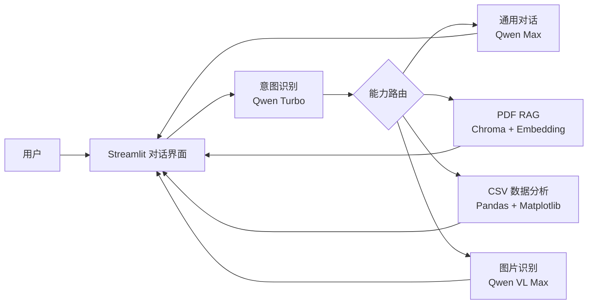

# Enterprise AI Copilot

一个基于 **Streamlit、LangChain 与通义千问** 的企业智能助手示例。系统会识别用户意图，并自动调用文档问答、数据分析、图片识别或通用对话能力。

## 功能特性

- **智能意图路由**：识别单个或多个任务，并分发到对应能力模块
- **PDF RAG 问答**：检索文档内容，回答问题并标注引用页码
- **CSV 数据分析**：根据自然语言生成 Pandas 代码、统计结果与图表
- **图片内容识别**：理解图片并返回结构化信息
- **多轮通用对话**：保留最近的会话上下文，支持连续提问

## 项目架构



## 快速开始

准备 Python 3.10+ 和 [DashScope API Key](https://help.aliyun.com/zh/model-studio/get-api-key)。

```bash
git clone https://github.com/ChiYuouo/chat-bot.git
cd chat-bot

python -m venv .venv
```

激活虚拟环境并安装依赖：

```bash
# Windows PowerShell
.\.venv\Scripts\Activate.ps1

# macOS / Linux
source .venv/bin/activate

python -m pip install -r requirements.txt
```

启动应用：

```bash
streamlit run chatbot.py
```

浏览器打开 `http://localhost:8501`，在左侧边栏填写 API Key，即可开始对话或上传 PDF、CSV、图片文件。

## 使用示例

| 场景 | 示例问题 |
| --- | --- |
| 文档问答 | `员工手册中规定的年假有多少天？` |
| 数据分析 | `统计各类别数量，并生成条形图。` |
| 图片识别 | `提取这张发票中的金额和日期。` |
| 普通对话 | `帮我写一封简短的会议邀请邮件。` |

## 目录结构

```text
chatbot.py              # 应用入口
app/
├── capabilities/       # RAG、数据分析、视觉与通用对话能力
├── ui/                 # Streamlit 页面与侧边栏
├── intent.py           # 意图识别
├── router.py           # 能力路由
├── config.py           # 模型与检索配置
└── state.py            # 会话状态管理
```

## 技术栈

`Python` · `Streamlit` · `LangChain` · `DashScope` · `ChromaDB` · `Pandas` · `Matplotlib`

> [!WARNING]
> CSV 分析模块会执行大模型生成的 Python 代码。当前实现适合学习和本地演示，请勿直接用于不受信任的数据或生产环境。
