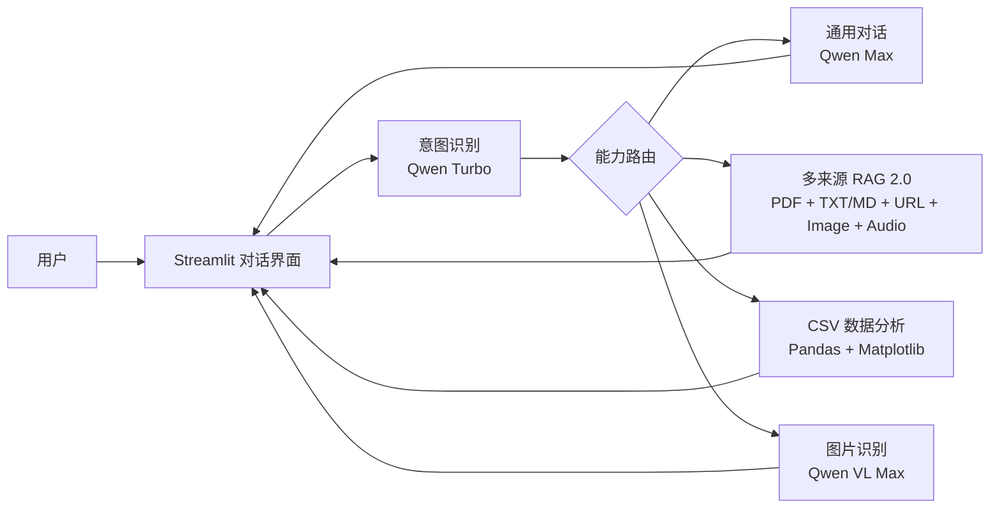

# Enterprise AI Copilot

一个基于 **Streamlit、LangChain 与通义千问** 的企业智能助手示例。系统会识别用户意图，并自动调用文档问答、数据分析、图片识别或通用对话能力。

## 功能特性

- **智能意图路由**：识别单个或多个任务；知识库存在时会对普通问题自适应检索，命中资料后自动切换到 RAG
- **多来源知识库**：支持 PDF、TXT/Markdown 文档、网页、图片和音频共存、跨来源检索、按来源删除和精确引用
- **RAG 问答**：结构化切分、原问题与改写问题多路召回、RRF 混排、带相关性阈值的 LLM 精排
- **CSV 数据分析**：根据自然语言生成 Pandas 代码、统计结果与图表
- **图片内容识别**：理解图片并返回结构化信息
- **多轮通用对话**：保留最近的会话上下文，支持连续提问

## 项目架构



## 快速开始

准备 Python 3.10+ 和 [DashScope API Key](https://help.aliyun.com/zh/model-studio/get-api-key)。

```bash
git clone https://github.com/ChiYuouo/chat-bot.git
cd chat-bot

python -m venv .venv
```

激活虚拟环境并安装依赖：

```bash
# Windows PowerShell
.\.venv\Scripts\Activate.ps1

# macOS / Linux
source .venv/bin/activate

python -m pip install -r requirements.txt
```

启动应用：

```bash
streamlit run chatbot.py
```

浏览器打开 `http://localhost:8501`，在侧边栏填写 API Key，即可添加 PDF、TXT/Markdown 文档、网页、图片、音频或 CSV 资料。音频 MVP 支持 MP3、WAV 和 M4A，单个文件最长 5 分钟、最大 7 MB。

## 使用示例

| 场景 | 示例问题 |
| --- | --- |
| 文档问答 | `对比员工手册和考勤制度中的年假规定。` |
| 网页问答 | `刚刚添加的公司制度网页中有哪些报销要求？` |
| 音频问答 | `会议录音中确认的上线时间和预算是多少？` |
| 数据分析 | `统计各类别数量，并生成条形图。` |
| 图片识别 | `提取这张发票中的金额和日期。` |
| 普通对话 | `帮我写一封简短的会议邀请邮件。` |

## 目录结构

```text
chatbot.py              # 应用入口
app/
├── capabilities/       # RAG、数据分析、视觉与通用对话能力
├── ingestion.py        # PDF、TXT/Markdown、网页、图片和音频资料解析
├── knowledge_base.py   # 资料集合与检索索引生命周期
├── source_utils.py     # 来源位置与检索文本处理
├── ui/                 # Streamlit 页面与侧边栏
├── intent.py           # 意图识别
├── router.py           # 能力路由
├── config.py           # 模型与检索配置
└── state.py            # 会话状态管理
```

## 技术栈

`Python` · `Streamlit` · `LangChain` · `DashScope` · `ChromaDB` · `HTTPX` · `Pandas` · `Matplotlib`

## RAG检索链路

```text
用户问题
  → 结合历史对话 Rewrite
  → 原问题：向量 Top 15 + 中文 BM25 Top 15
  → 改写问题：向量 Top 15 + 中文 BM25 Top 15
  → RRF 混排 Top 10
  → Qwen Listwise 相关性评分（默认阈值 0.55）
  → Top 4 生成答案并标注来源
```

PDF、TXT/Markdown 文档、网页正文、图片提取结果和音频转写文本会进入同一个知识库。资料先按章节、条款和编号标题进行结构化切分，再在结构段内部按长度生成 Chunk；PDF 额外保留页码，Markdown 标题会作为章节结构，网页保留原始 URL，图片由视觉模型提取 OCR、客观描述和实体，音频由 ASR 转写并保留起止时间。聊天界面的“查看 RAG 检索过程”会展示改写结果、多路召回、混排、相关性分数、阈值过滤结果和各阶段耗时。Rewrite、精排失败时都会自动降级，不会中断问答。

用户不需要在问题中刻意写“根据文档”或“根据网页”。当意图识别结果为普通问答且知识库非空时，系统会先进行一次混合检索和相关性精排；命中高相关资料后自动使用 RAG，未命中则继续普通问答。这个判断作用于 PDF、TXT/Markdown、网页、图片和音频等全部知识来源。

### RRF 混排

[`app/rag/retrieval.py`](app/rag/retrieval.py) 中的 `reciprocal_rank_fusion` 会累加同一个 chunk 在多路召回中的倒数排名分数：

实现公式：

```text
score(document) = Σ 1 / (rrf_k + rank_i)
```

对应单元测试位于 [`tests/test_rag_retrieval.py`](tests/test_rag_retrieval.py)。

> [!WARNING]
> CSV 分析模块会在受限子进程中执行大模型生成的 Python 代码，并进行语法检查与超时控制；这仍不能替代生产环境的容器沙箱、网络隔离与操作系统级资源限制。

## 运行测试

项目测试不依赖真实 API Key：

```bash
python -m unittest discover -s tests -v
```
